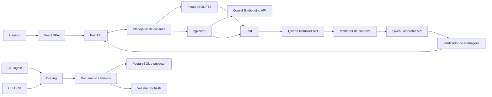

# Especificação técnica — RAG de livros

Status: aprovado para implementação da fase 1  
Idioma do produto e do acervo: português  
Escala-alvo: menos de 1.000 livros  
Ambiente inicial: privado, usado por uma pessoa, via Docker Compose em uma VM Linux

## 1. Objetivo

Construir uma aplicação RAG capaz de:

1. localizar termos e trechos literalmente;
2. recuperar passagens semanticamente relacionadas;
3. sintetizar conceitos distribuídos em capítulos e livros diferentes;
4. identificar convergências, divergências e limites entre obras;
5. vincular cada afirmação gerada a evidências verificáveis;
6. abster-se quando o acervo não sustentar uma resposta.

A aplicação terá dois contratos de resposta:

- `quote`: retorna somente trechos literais ranqueados;
- `dissertative`: produz síntese apoiada nas referências e verifica cada afirmação antes da entrega.

## 2. Princípios obrigatórios

- As passagens originais são a fonte de verdade. Resumos e perfis conceituais nunca são citados como evidência primária.
- O modelo não pode complementar respostas com conhecimento externo ao acervo.
- Toda edição é uma fonte distinta, mesmo quando pertence à mesma obra.
- Recuperação lexical, semântica e reranking devem ser componentes separáveis e mensuráveis.
- Filtros e decisões inferidos da pergunta devem ser retornados ao cliente.
- O núcleo de domínio não depende de LangChain. Bibliotecas de integração não podem controlar o modelo de dados nem o contrato de evidências.
- Toda configuração que afeta uma resposta deve ser versionada.
- Falhas de modelos, banco, parsing ou verificação devem falhar de forma explícita; não pode haver resposta “sem RAG” como fallback silencioso.

## 3. Escopo

### 3.1 Incluído na fase 1

- ingestão manual por CLI de PDF com texto e EPUB;
- conversão separada, por CLI, de PDF escaneado usando Docling/OCR;
- extração e indexação apenas de conteúdo textual;
- representação estrutural por obra, edição, seção, página e passagem;
- busca textual em português e busca vetorial;
- fusão RRF e reranking;
- resumos hierárquicos e perfis conceituais apoiados por passagens;
- filtros positivos e negativos por obra/edição;
- chat com contexto limitado à sessão;
- modos `quote` e `dissertative`;
- profundidades `brief`, `standard` e `deep`;
- verificação obrigatória da resposta dissertativa;
- leitor com navegação até a página e destaque do trecho;
- benchmark interno e rastreabilidade de respostas;
- telemetria anonimizada com retenção de 90 dias.

### 3.2 Fora da fase 1

- plataforma colaborativa;
- contas, reputação, votação e adjudicação;
- autenticação de produção;
- bibliotecas privadas ou multi-tenant;
- interpretação semântica de imagens, tabelas ou diagramas;
- banco de grafos;
- memória persistente do usuário;
- relatórios assíncronos;
- exposição pública.

## 4. Arquitetura



### 4.1 Componentes

- **SPA:** React + TypeScript, estado remoto tipado, streaming SSE e PDF.js.
- **API:** FastAPI com request/response Pydantic e tratamento centralizado de erros.
- **Domínio:** Python puro, sem dependência de FastAPI, ORM ou SDK de modelo.
- **Persistência:** PostgreSQL com pgvector, FTS, `unaccent` e `pg_trgm`.
- **Artefatos:** volume local persistente, organizado por hash SHA-256.
- **Modelos:** adapters HTTP para geração, embedding e reranking.
- **Execução:** Docker Compose e proxy reverso.

## 5. Modelo de domínio

### 5.1 Entidades principais

#### Work

Representa a obra intelectual.

- `id: UUID`
- `canonical_title: str`
- `original_title: str | null`
- `authors: list[Contributor]`
- `language: "pt"`
- `created_at`
- `updated_at`

#### Edition

Representa uma edição física ou digital específica.

- `id: UUID`
- `work_id: UUID`
- `title: str`
- `publisher: str | null`
- `publication_year: int | null`
- `isbn: str | null`
- `edition_label: str | null`
- `source_type: pdf_text | pdf_scan | epub`
- `source_sha256: str`
- `license_status: unknown | public_domain | licensed | restricted`
- `ingestion_status`
- `created_at`

Não pode haver duas edições com o mesmo `source_sha256`.

#### Section

- `id: UUID`
- `edition_id: UUID`
- `parent_section_id: UUID | null`
- `level: int`
- `ordinal: int`
- `title: str | null`
- `path: list[str]`
- `start_page: int | null`
- `end_page: int | null`

#### Page

- `id: UUID`
- `edition_id: UUID`
- `physical_index: int`
- `printed_label: str | null`
- `text: str`
- `text_sha256: str`

#### Passage

- `id: UUID`
- `edition_id: UUID`
- `section_id: UUID | null`
- `page_start_id: UUID | null`
- `page_end_id: UUID | null`
- `ordinal: int`
- `text: str`
- `token_count: int`
- `char_start: int | null`
- `char_end: int | null`
- `context_header: str`
- `text_search: tsvector`
- `embedding: vector`
- `embedding_version_id: UUID`
- `chunking_version_id: UUID`

#### Summary

- `id: UUID`
- `scope_type: section | chapter | edition`
- `scope_id: UUID`
- `text: str`
- `generator_version_id: UUID`
- `supporting_passage_ids: list[UUID]`

Todo resumo deve ter pelo menos uma passagem de suporte e não pode ser apresentado como citação literal.

#### Concept e ConceptAlias

- `Concept`: identificador, rótulo normalizado, descrição e estado;
- `ConceptAlias`: conceito, expressão alternativa e confiança;
- `ConceptEvidence`: conceito, passagem, confiança e versão do extrator;
- estados: `proposed | accepted | merged | rejected`.

Na fase 1, conceitos podem ser propostos automaticamente. Não haverá workflow administrativo completo de curadoria.

#### AnswerRun

Registra:

- pergunta original e versão anonimizada;
- consulta reescrita;
- filtros explícitos e inferidos;
- estratégia selecionada;
- candidatos lexical e vetorial;
- ranking fundido e reranking;
- evidências selecionadas;
- resposta estruturada;
- resultado da verificação;
- versões de documento, extração, chunking, embeddings, modelos e prompts;
- latências por estágio;
- status final.

## 6. Versionamento

Devem existir registros imutáveis para:

- `ExtractionVersion`;
- `ChunkingVersion`;
- `EmbeddingVersion`;
- `ModelEndpointVersion`;
- `PromptVersion`;
- `RetrievalPolicyVersion`.

Uma reindexação cria novas versões e não altera silenciosamente o significado de execuções anteriores. A remoção física de artefatos antigos pode ser uma operação administrativa posterior.

## 7. Ingestão

### 7.1 Contratos de CLI

```text
rag ingest <arquivo.pdf|arquivo.epub> --metadata <arquivo.yaml> [--dry-run]
rag ocr <arquivo.pdf> --output <arquivo.pdf|diretorio> [--engine <nome>]
rag index <edition-id> [--force]
rag inspect <edition-id>
```

Requisitos:

- `--dry-run` valida arquivo, metadados, idioma e duplicidade sem persistir;
- comandos retornam código diferente de zero em falha;
- logs são estruturados e não incluem conteúdo integral do livro;
- operações repetidas com os mesmos inputs são idempotentes;
- o CLI não publica automaticamente arquivos parcialmente processados.

### 7.2 Representação canônica

O resultado da extração deve preservar:

- hierarquia de títulos;
- ordem de leitura;
- limites e rótulos de página, quando disponíveis;
- offsets necessários para destacar o trecho;
- texto normalizado e texto original suficiente para citação;
- warnings de extração.

Docling é um adapter. O restante do sistema consome um schema canônico próprio e não objetos internos do Docling.

### 7.3 Chunking

O chunker deve:

1. respeitar limites de seção e parágrafo;
2. evitar misturar capítulos diferentes;
3. manter frases completas;
4. incluir um cabeçalho contextual não citável com obra, seção e subseção;
5. permitir sobreposição configurável;
6. guardar a associação exata aos trechos originais;
7. produzir chunks-filho para recuperação e referências aos pais para expansão de contexto.

Tamanho, sobreposição e expansão parental são parâmetros versionados e calibrados por avaliação.

### 7.4 Enriquecimento hierárquico

Após a indexação das passagens:

1. gerar resumos por seção;
2. compor resumos de capítulos somente a partir de resumos/trechos filhos;
3. gerar resumo da edição;
4. extrair conceitos e aliases;
5. associar cada afirmação abstrata às passagens de suporte.

Se o suporte não puder ser identificado, o item abstrato não é publicado no índice.

## 8. Recuperação

### 8.1 Request lógico

```text
QueryRequest:
  question: string
  answer_mode: quote | dissertative
  depth: brief | standard | deep
  search_strategy: automatic | literal | hybrid | expanded
  include_edition_ids: UUID[]
  exclude_edition_ids: UUID[]
  session_id: UUID | null
```

### 8.2 Planejamento

O planejador produz uma estrutura validada:

- intenção: `factual | conceptual | comparative | navigational`;
- consulta lexical;
- consulta semântica;
- zero ou mais subperguntas;
- aliases e conceitos;
- filtros inferidos;
- necessidade de diversidade;
- necessidade de índice hierárquico.

Entradas inferidas nunca substituem filtros explícitos. Exclusões explícitas prevalecem sobre inclusões inferidas.

### 8.3 Estratégias

- `literal`: FTS e similaridade textual; não gera expansão semântica.
- `hybrid`: FTS + embedding + RRF + reranking.
- `expanded`: híbrida com sinônimos e subperguntas controladas.
- `automatic`: escolhe uma das anteriores e registra a justificativa.

O frontend mostra a estratégia final e filtros inferidos como chips editáveis.

### 8.4 Busca lexical

- usar configuração portuguesa do PostgreSQL;
- manter uma forma normalizada sem acentos;
- suportar frase exata, termos obrigatórios e termos excluídos;
- usar `pg_trgm` somente para tolerância a variações/erros, com limiar configurável;
- não interpolar entradas do usuário em SQL.

### 8.5 Busca vetorial e fusão

- embeddings de consulta e documento devem usar versões compatíveis;
- distância padrão: cosseno, salvo justificativa validada;
- recuperar listas lexical e semântica separadamente;
- fundir rankings por Reciprocal Rank Fusion;
- enviar candidatos fundidos ao reranker;
- guardar scores e posições de todos os estágios.

Parâmetros como `top_k`, constante RRF e `rerank_top_n` pertencem à política de profundidade e são calibráveis.

### 8.6 Diversidade adaptativa

- consultas factuais: maximizar relevância;
- consultas comparativas ou conceituais amplas: aplicar limite flexível por edição e diversificação por conceito;
- nunca incluir uma obra menos relevante apenas para atingir uma quantidade fixa;
- a ausência de uma perspectiva não pode ser descrita como discordância.

### 8.7 Índice hierárquico

Resumos e conceitos servem para localizar regiões promissoras. Antes da geração:

1. selecionar nós hierárquicos relevantes;
2. descer até passagens originais;
3. reranquear as passagens;
4. citar somente as passagens.

## 9. Geração

### 9.1 Políticas de profundidade

As políticas controlam orçamento de candidatos, número de evidências, diversidade, decomposição, contexto e extensão. Valores iniciais devem ser conservadores e depois calibrados.

- `brief`: resposta direta, poucos trechos e até três parágrafos;
- `standard`: explicação, fontes relevantes e comparação quando aplicável;
- `deep`: decomposição, recuperação iterativa limitada, convergências, divergências, limites e inferências marcadas.

### 9.2 Modo quote

Não chama o gerador para redigir uma resposta. Retorna:

- trechos literais;
- score e ordem;
- obra e edição;
- seção;
- página física e rótulo impresso;
- offsets de destaque;
- identificador estável da passagem.

Uma eventual tradução, paráfrase ou título produzido por LLM viola esse contrato.

### 9.3 Modo dissertative

O gerador recebe blocos separados:

1. política imutável do sistema;
2. contrato de saída;
3. pergunta e contexto da sessão;
4. filtros e escopo;
5. evidências numeradas;
6. instrução de profundidade.

Saída interna obrigatória:

```text
GeneratedAnswer:
  answer_markdown: string
  claims:
    - id: string
      text: string
      evidence_ids: UUID[]
      inference: boolean
  limitations: string[]
  abstained: boolean
  abstention_reason: string | null
```

### 9.4 Verificação

Toda resposta dissertativa passa por uma segunda etapa que:

- divide e normaliza afirmações;
- verifica se cada evidência realmente sustenta a afirmação;
- mede cobertura de citações;
- rejeita IDs inexistentes;
- identifica contradições entre resposta e fonte;
- remove, corrige ou marca inferências sem suporte direto;
- força abstenção se o suporte global ficar abaixo do limiar.

O verificador não pode introduzir novas afirmações. Se a correção exigir conteúdo novo, a resposta deve voltar ao gerador e ser verificada novamente, com limite de iterações.

## 10. APIs

Prefixo: `/api/v1`.

### 10.1 Consultas

- `POST /queries`: inicia uma consulta;
- `GET /queries/{query_id}`: retorna estado e resultado;
- `GET /queries/{query_id}/events`: stream SSE;
- `POST /queries/{query_id}/cancel`: cancela processamento ativo.

Respostas de erro:

```json
{
  "error": {
    "code": "MODEL_TIMEOUT",
    "message": "Não foi possível concluir a consulta.",
    "request_id": "uuid"
  }
}
```

Nenhuma resposta de erro expõe stack trace, caminho local, SQL ou credenciais.

### 10.2 Acervo

- `GET /works`;
- `GET /works/{work_id}`;
- `GET /editions/{edition_id}`;
- `GET /editions/{edition_id}/passages/{passage_id}`;
- `GET /editions/{edition_id}/source` com suporte a range requests.

### 10.3 Sessões

- `POST /sessions`;
- `GET /sessions/{session_id}`;
- `DELETE /sessions/{session_id}`.

O histórico pode ajudar a reescrever perguntas subsequentes, mas cada execução registra a pergunta autônoma resultante.

## 11. Adapters de modelos

Interfaces mínimas:

```python
class EmbeddingProvider(Protocol):
    async def embed_documents(self, texts: list[str]) -> list[list[float]]: ...
    async def embed_query(self, text: str) -> list[float]: ...

class RerankerProvider(Protocol):
    async def rerank(self, query: str, documents: list[str]) -> list[float]: ...

class GeneratorProvider(Protocol):
    async def generate(self, request: GenerationRequest) -> GeneratedAnswer: ...
```

Requisitos:

- autenticação por variáveis de ambiente ou secret files;
- timeouts configuráveis por operação e maiores para profundidade `deep`;
- retries apenas para falhas transitórias e operações idempotentes;
- circuit breaker;
- limite de concorrência;
- validação de dimensão do embedding;
- modelos Qwen configuráveis, sem nomes fixos no código de domínio;
- não registrar prompts completos contendo conteúdo dos livros em logs comuns.

## 12. Frontend

### 12.1 Tela de consulta

- campo de pergunta;
- modo de resposta;
- profundidade;
- estratégia de busca;
- filtros por obra/edição;
- chips de filtros inferidos, inclusive exclusões;
- indicação de progresso por estágio;
- cancelamento;
- resposta e lista de fontes.

### 12.2 Leitor

- abrir o PDF da edição citada;
- navegar até a página física correta;
- destacar o trecho;
- exibir seção, página impressa e passagem;
- informar claramente quando EPUB não tiver paginação estável.

### 12.3 Segurança do cliente

- não renderizar Markdown/HTML sem sanitização;
- não armazenar tokens ou segredos em `localStorage`;
- não aceitar URLs arbitrárias de documentos;
- configurar CSP e demais headers no proxy/API.

## 13. Observabilidade e retenção

### 13.1 Logs

Logs JSON com:

- `request_id`, `query_id`, estágio, status e latência;
- IDs e versões, não textos integrais;
- erros internos sanitizados;
- redaction de autorização, chaves, tokens e dados pessoais.

### 13.2 Métricas

- latência e erro por endpoint/estágio;
- tamanho das listas de candidatos;
- taxa de timeout de modelos;
- cobertura de citações;
- taxa de abstenção;
- falhas de verificação;
- distribuição de fontes por resposta;
- duração e falha de ingestão.

### 13.3 Traces

Instrumentar API, consultas SQL e chamadas de modelos com OpenTelemetry. Conteúdo textual não entra em atributos de trace.

### 13.4 Retenção

- consultas e respostas normais: versão anonimizada por até 90 dias;
- artefatos técnicos necessários à reprodução: conforme política administrativa;
- exclusão automática e verificável;
- consultas comuns nunca são publicadas como contribuições colaborativas.

## 14. Segurança e operação

- ambiente inicial acessível apenas por localhost, VPN ou rede privada;
- autenticação OIDC é requisito antes da exposição pública;
- métodos HTTP explícitos e validação de body, query e path;
- queries SQL parametrizadas;
- rate limiting por IP/sessão, inclusive no ambiente de demonstração;
- CORS restrito à origem configurada;
- cookies, se usados no futuro, `Secure`, `HttpOnly` e `SameSite=Strict`;
- headers: HSTS, CSP, `nosniff`, `DENY`, Referrer-Policy e Permissions-Policy;
- segredos somente por ambiente/secret files;
- backups do PostgreSQL e do volume de artefatos devem ser consistentes;
- nenhuma dependência pode ser adicionada sem aprovação e pinagem;
- health checks separados para liveness e readiness.

## 15. Avaliação

### 15.1 Estrutura de um item

```text
EvaluationItem:
  question
  question_type
  scope
  required_evidence
  forbidden_claims
  rubric
  exemplary_answers
  should_abstain
```

Tipos obrigatórios:

- factual;
- busca literal;
- conceitual intraobra;
- conceitual entre obras;
- comparativa;
- fontes conflitantes;
- pergunta ambígua;
- sem resposta no acervo;
- filtro positivo;
- filtro negativo;
- continuação de sessão.

### 15.2 Métricas

Recuperação:

- Recall@K das evidências;
- MRR/nDCG;
- ganho do reranker sobre a fusão;
- cobertura por livro em perguntas comparativas.

Resposta:

- precisão de citações;
- cobertura de afirmações;
- fidelidade às fontes;
- correção de abstenção;
- atendimento à rubrica;
- detecção de conflito.

Desempenho:

- p50/p95 por estágio;
- taxa de erro e timeout;
- tokens e chamadas por profundidade.

Avaliação por LLM pode auxiliar, mas não substitui rubricas e revisão humana.

## 16. Critérios de aceitação

- **AC-01:** reingerir o mesmo arquivo e metadados não duplica a edição.
- **AC-02:** duas edições da mesma obra permanecem distinguíveis e citáveis.
- **AC-03:** toda passagem citada abre a edição, página e trecho corretos.
- **AC-04:** busca literal encontra frases exatas em português.
- **AC-05:** busca semântica encontra paráfrases sem compartilhar termos principais.
- **AC-06:** resultados híbridos registram ranking lexical, vetorial, RRF e reranking.
- **AC-07:** exclusão de obra, explícita ou inferida e confirmada, impede sua presença em todos os estágios.
- **AC-08:** modo `quote` não contém texto sintetizado.
- **AC-09:** modo `dissertative` não contém afirmação factual sem evidência válida ou marcação explícita de inferência.
- **AC-10:** pergunta sem suporte produz abstenção.
- **AC-11:** pergunta comparativa não é respondida com evidências de somente uma obra sem declarar a limitação.
- **AC-12:** resumos hierárquicos levam a passagens originais; resumos não aparecem como citações.
- **AC-13:** contexto de sessão é convertido em pergunta autônoma registrada e inspecionável.
- **AC-14:** falha ou timeout de modelo retorna erro tipado e não aciona geração sem evidências.
- **AC-15:** cada resposta registra todas as versões e evidências necessárias à reprodução.
- **AC-16:** logs e traces não contêm segredos nem texto integral dos livros.
- **AC-17:** conteúdo anonimizado expira automaticamente após 90 dias.
- **AC-18:** API aplica validação, CORS restrito, rate limiting e headers de segurança.
- **AC-19:** benchmark executa de forma repetível e compara configurações sem sobrescrever resultados anteriores.
- **AC-20:** `docker compose up` inicia um ambiente funcional após configuração documentada, sem credenciais hardcoded.

## 17. Restrições anteriores à produção

A aplicação não pode ser disponibilizada publicamente até:

1. escolher e integrar autenticação OIDC;
2. implementar autorização;
3. decidir política jurídica por edição;
4. definir limites de exibição e exportação de citações;
5. concluir threat model e revisão de segurança;
6. testar restauração de backups.
